# HOW TO CONNECT TO YOUR EC2 INSTANCE (WINDOWS & LINUX) USING EC2 INSTANCE CONNECT ENDPOINT

EC2 instance connect endpoint allows you to connect to your EC2 instance without using a public IP, an internet gateway, a NAT gateway, or just exposing your EC2 to the Internet.

### STEPS:

1.	Create an EC2 instance connect endpoint: 

Go to VPC section, look for “PrivateLink and Lattice”, scroll down the options and click on “Endpoints”, then click on “Create Endpoint”, choose the option “EC2 instance connect endpoint”, select the VPC where the EC2 instance is located, choose the security group and the Subnet (you must choose a private subnet, because the EC2 is not supposed to have Internet connection). The creation may take some minutes.

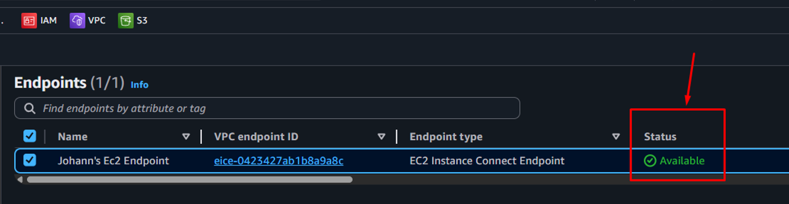

2. You must create an IAM USER or attach some policies to an existing IAM user: 

Go to IAM, click on “Users”, “Create user”, assign a name to the user (you can select the box “Provide user access to the AWS Management console” depending on your needs, for this case it is irrelevant). Click on “next”, choose the option “Attach policies directly” and “Create policy”. You must create two policies; an AWS managed and an inline policy.
For the AWS managed policy, look for “AmazonEC2ReadOnlyAccess” policy, select it and click on “next” and “Create user”. After creating the user, scroll down the “Add permissions” option and select “Create inline policy”.

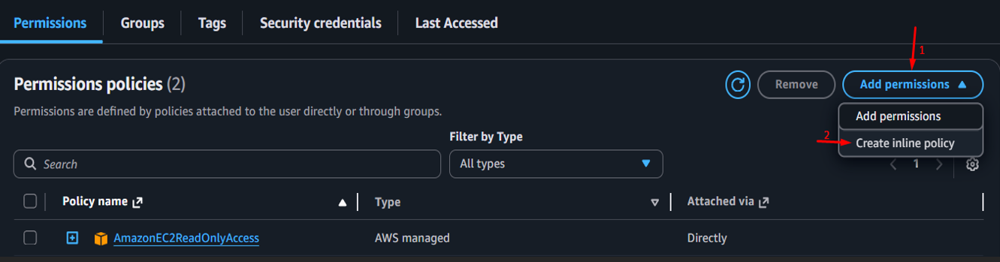

After that, select “JSON” option and delete the policy and enter the policy shown in the image:

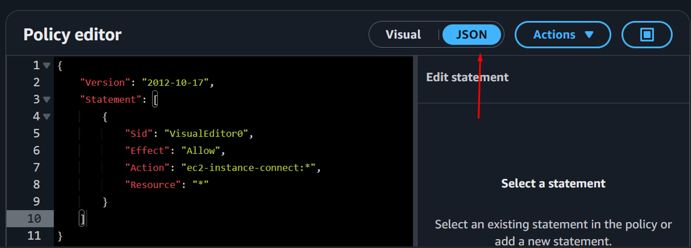

3.	You must create an Access Key for the user:
Select the user, click on “Security credentials” and select "Create access key”

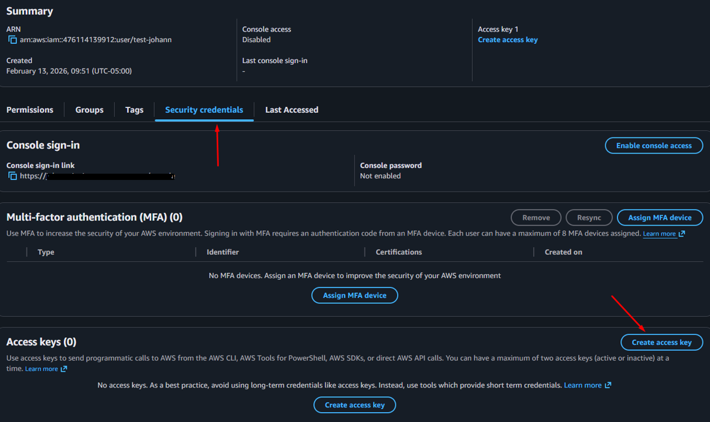

Then choose the use case “Command Line Interface (CLI)”

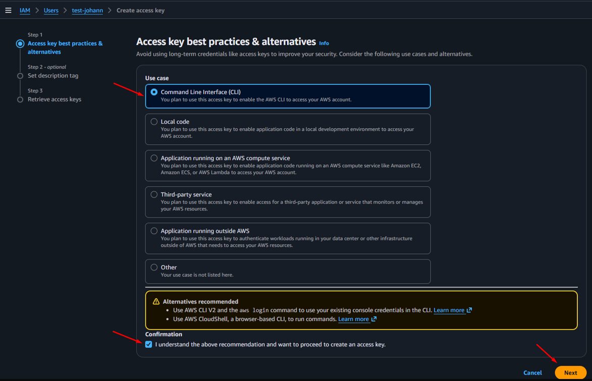

Then click on “Create Access Key”, you must save secretly the keys (Access key & Secret access key).

4.	In your local machine, from where you want to connect remotely to your AWS EC2 instance, we must establish a private tunnel to the EC2 instance, so run the following command (it works both Windows and Linux):

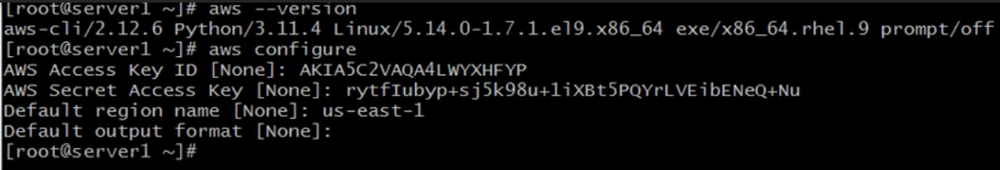

After executing the command, you must complete the options with the access key created in step 3. In the Default region name, you must enter the region where your EC2 instance is located, the output format can be the default.

          4.1.	If you want to connect to a Linux EC2 instance, you must execute the following command to connect the EC2 instance:

aws ec2-instance-connect ssh  --instance-id <instance id>  --private-key-file "path of the Key-pair”

This command can be executed from Windows and Linux machine:

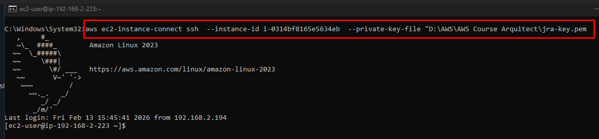

Note: Take in mind that when you created your EC2 instance, you selected or created a Key-Pair. 
The instance ID you can find it at the instances section.

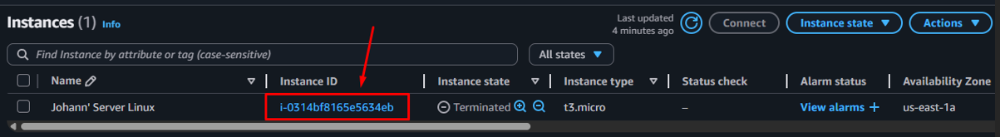

          4.2.	If you want to connect to a Windows EC2 instance, you must execute the following command to connect the EC2 instance:

aws ec2-instance-connect open-tunnel  --instance-id <instance id>  --remote-port 3389 --local-port <any-port>

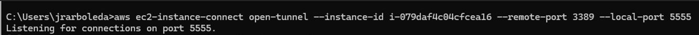

After that, you must execute Microsoft Remote Desktop and use the same parameters that you used at the above command.

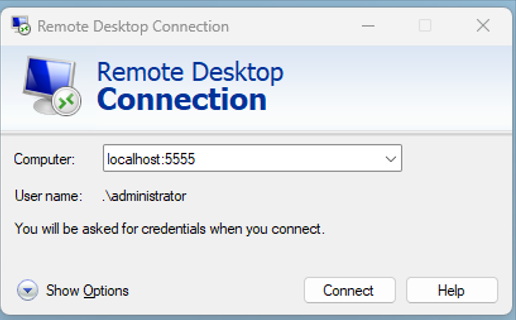
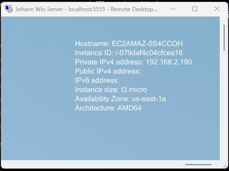
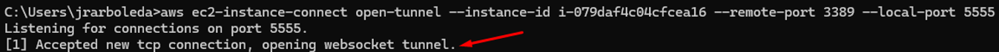

Note: Take in mind that this is a Windows EC2, so you must allow all RDP (3389) incoming traffic.

