# PROCESS TO DOWNLOAD FILES FROM S3 STANDARD AND S3 GLACIER FLEXIBLE RETRIEVAL TO ON-PREMISEs SERVER

In this article, let’s talk about how to download files from two different tiers of S3 (Standard and Glacier Flexible Retrieval). Let’s break down in two sections to address both cases. 

The following steps will allow you to establish a connection between your AWS account and your On-Premises server:

1.	You must create an Access Key for the user: Select the user, click on “Security credentials” and select "Create access key”

# 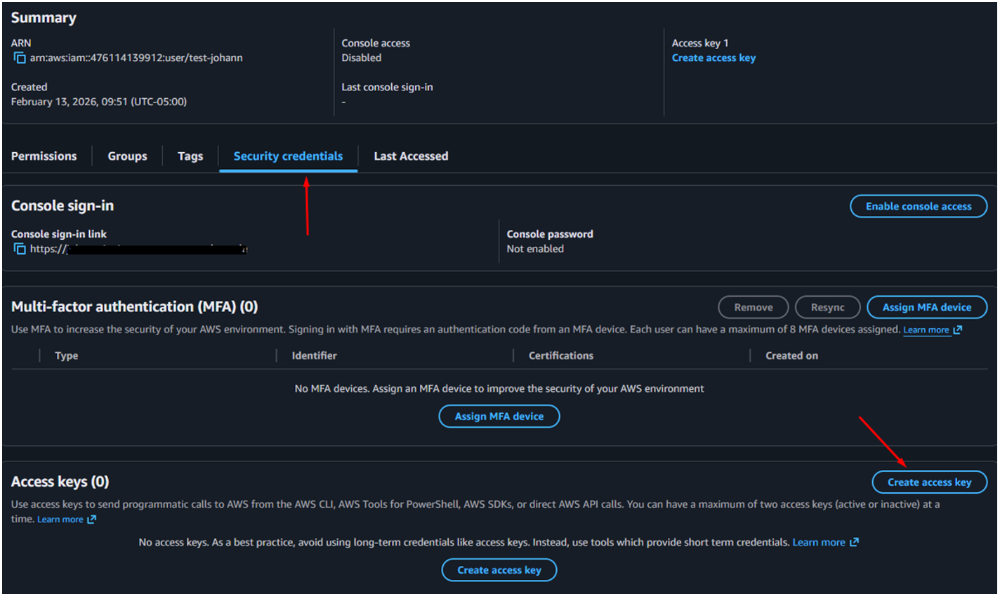

Then choose the use case “Command Line Interface (CLI)”

# 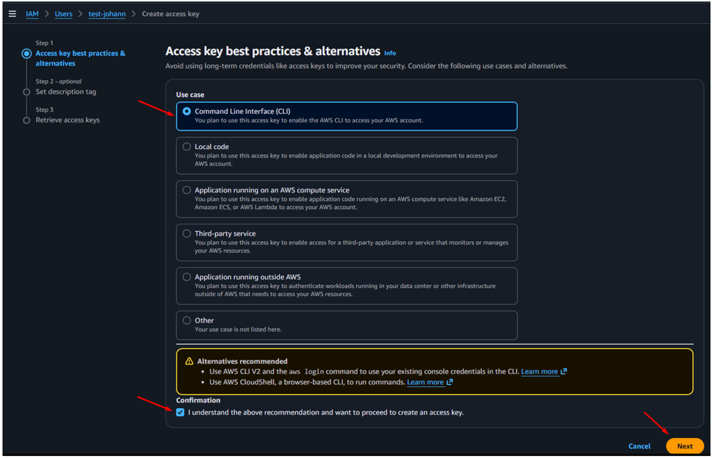

Then click on “Create Access Key”, you must save secretly the keys (Access key & Secret access key).

2.	In your local machine, from where you want to connect remotely to your AWS resources (in this case, an S3 bucket), we must establish a private tunnel to the EC2 instance, so run the following command (it works both Windows and Linux):

# 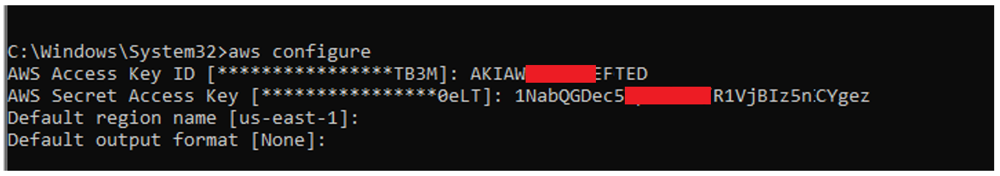

After executing the command, you must complete the options with the access key created in step 1. In the Default region name, you must enter the region where your S3 Bucket is located, the output format can be the default.

3.	Execute the next command to list the S3 Bucket in your account:

# 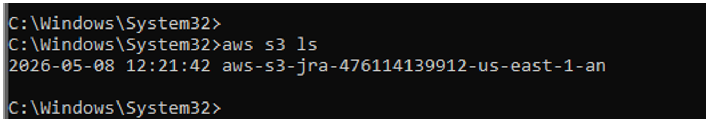

This output will confirm you the connection between your AWS account and your Local machine.

From this point, let’s address the two cases (Standard and Glacier Flexible Retrieval), let’s start with Standard.
There are two ways to download files from S3 standard, you can use “AWS S3 sync” or “s5cmd sync”. The main difference between them is performance, concurrency, and scalability for massive workloads.

## AWS S3 Sync:

This is the official command from AWS CLI, it’s very stable, great for automation, supports nearly all S3 features, but it has some cons, for example, slower with millions of files, limited parallelism, higher per-file overhead and object listing can become slow at scale. This command is ideal for standard backup, small to medium sync operations, and typical DevOps scripts.

Example:
If you want to know the amount and size of the files to download, execute the following command:

      aws s3 ls s3://Your-Bucket --recursive --human-readable --summarize

# 

To download the files, run this following command:
 
        aws s3 sync s3://my-bucket/path/  D:\My-local-path --progress

Advantages:

•	Automatically resumes 

•	Downloads only missing files 

•	Parallelizes downloads 

•	Tolerates interruptions 

•	Ideal for huge datasets

## S5cmd sync:
This is a high-performance open source S3 tool that allows you to copy, synchronize, list and delete files in S3 buckets, so you must download it and install it on your local machine. It’s significantly faster, massive parallelism, excellent for millions of small files, efficient concurrent uploads/downloads and better network throughput utilization, but it has some cons, for example, fewer advanced features than AWS CLI, missing some AWS-specific functionality, less common as an enterprise standard. This is ideal for big data pipelines, large data lakes, massive backups, high-throughput workloads and massive objects synchronization.

Example:

To download thousands of files from S3 standard, use the following command:

      s5cmd --numworkers 128 sync "s3://your-s3-bucket/*" "H:\Your-Local-path\"

numworkers: It defines how many workers (threads/concurrent connections) the tool will use. This means there will be 128 simultaneous operations. Keep in mind that the higher the number, the greater the CPU and network bandwidth utilization.

Now, let’s talk about how to download files from S3 Glacier Flexible Retrieval. In this case, you must understand that the files are archived and they can’t be downloaded immediately. Therefore, there are three phases: restoring the file from Glacier, waiting until the file is restored, and downloading the file.

### Restoring the file from Glacier:

For Glacier Flexible Retrieval, I recommend you use S3 batch operations, because it’s a feature that lets you perform bulk actions on millions or even billions of objects stored in S3 buckets, for example, copy objects between buckets, update object tags or permissions, restore archived objects from Glacier, encrypt existing objects.

#### How to create a S3 batch operations job:

Go to Amazon S3, look for Batch Operations, click on “Create job”, choose the new AWS feature “Generate an object list by specifying filters”, and browse the S3 bucket as your source. Then, click on “next”, and choose the “Restore” operation, for this case, I chose “Glacier Flexible Retrieval”. The number of days that the restored copy is available is the number of days you want to have temporarily available your restored files. At the Retrieval tier, you choose depending on your needs. “Bulk retrievals” for Glacier Flexible Retrieval typically finish within 5–12 hours (usually free). For Glacier Deep Archive, retrievals typically finish within 48 hours (Charged). “Standard retrievals” for Glacier Flexible Retrieval typically start within minutes and finish within 3–5 hours (charged). For Glacier Deep Archive, retrievals typically start within 9 hours and finish within 12 hours (charged).

# 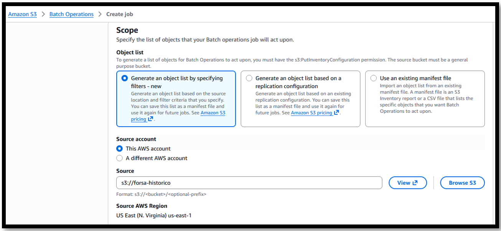
# 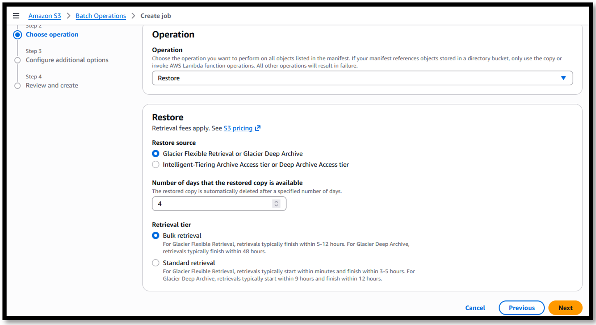

Then, save the job and run it, on the Batch operations pane, you will see the job was 100% completed, but for this case (Bulk retrieval), we must wait until 12 hours while the objects are being restored.  

# 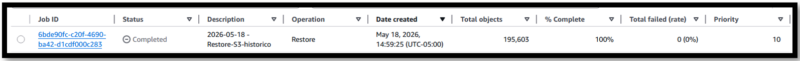

If you want to be sure the object is available for downloading, you can verify it with the next CLI command:

        aws s3api head-object --bucket your-bucket --key "the-complete-path-of-your-file"

If the output is “true”, you can’t download it because is not available:

# 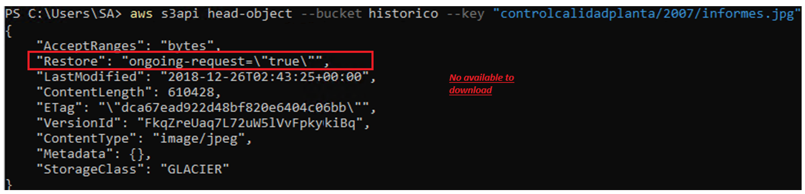

If the output is “false”, you can download it:

# 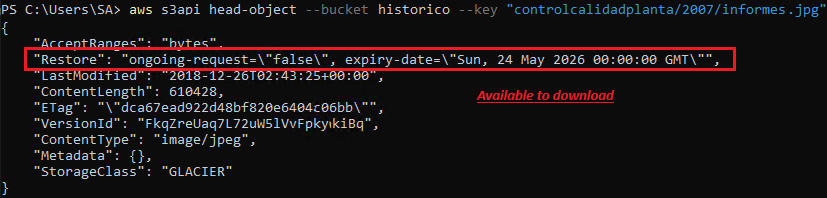

Another way to verify if the object is ready to be downloaded is through the AWS console. Go to the S3 bucket and locate the file you want to download, you will see a message like this:

# 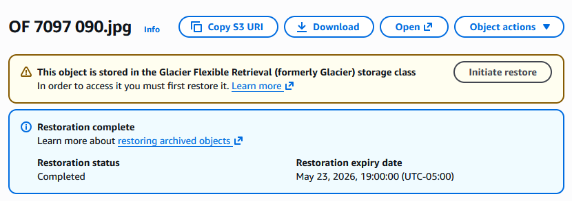

### Downloading the file:

After the file is available to be downloaded, you must use the following command:

        aws s3 sync "s3://your-bucket" "H:\your-local-path" --force-glacier-transfer

-- force-glacier-transfer: if an object in S3 is stored in archival storage classes, the sync command skips those objects because they are considered archived (“cold” storage). This command will attempt to transfer archived objects as well. This doesn’t mean it can instantly download Glacier objects that have not been restored. If the object is still archived and not restored yet, you will usually get errors like:

# 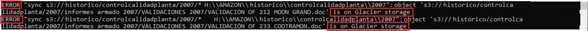

Sometimes, you will get some errors because of the too long windows path, therefore, you must enable long paths in Windows. Go to gpedit.msc, then follow this path: Local Computer Policy > Computer configuration > Administrative templates > System > Filesystem and enable the option “Enable Win32 long paths”

# 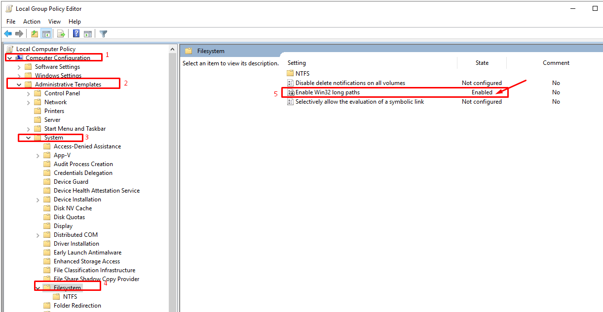

As you can see, we were able to successfully download files from both the Standard and Glacier Flexible Retrieval S3 buckets.