# HOW TO CREATE AN AWS VPN SITE TO SITE

AWS Site-to-Site VPN is a fully managed service that creates secure, encrypted IPsec tunnels between your on-premises data centers or branch offices and Amazon VPCs or AWS Transit Gateways

# 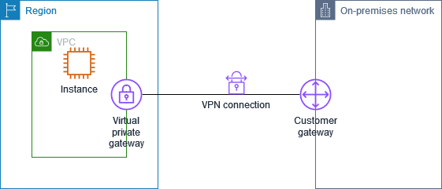

Let’s create a VPN site to site to communicate an AWS VPC to a Local network. The first thing that we need to know is the parameters of each network. For this case, we’ll use:

* Local IPv4 network CIDR: 10.75.0.0/24

* Remote IPv4 network CIDR: 192.168.44.0/ 24

* Public IP of my customer network: 201.**.##.30

With this information, let’s create the customer gateway. The customer gateway is just a physical device or software application on your side of the Site-to-Site VPN connection.

### STEPS:

1.	Go to “VPC > Customer gateway”, then, click on “Create customer gateway”. Fill in the gaps with your information. The IP address is the public address of your router or firewall:

# 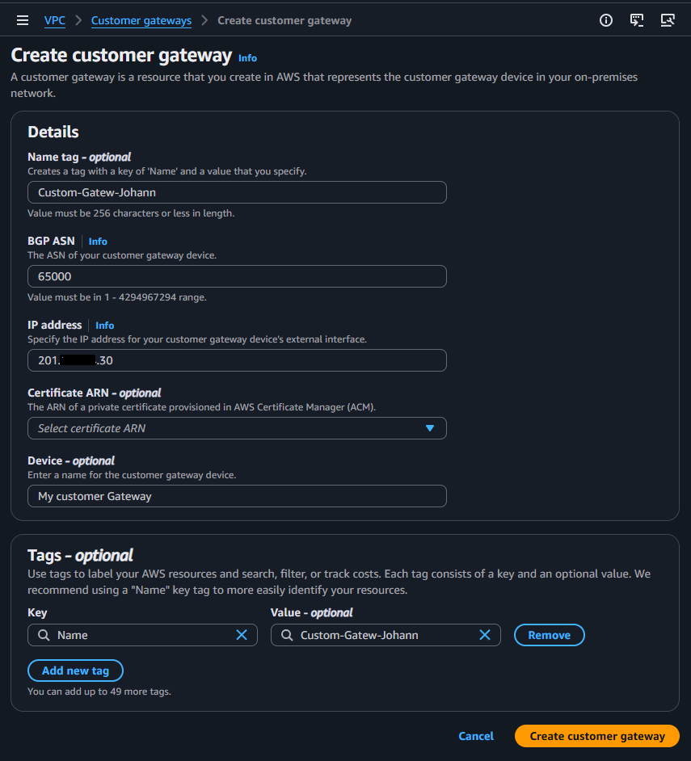

Then, you’ll see something like this: 

# 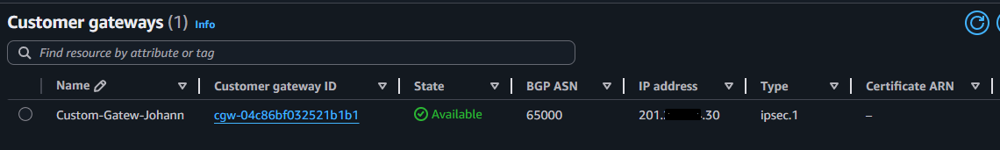

2.	You must create a Virtual private gateway. Virtual private gateway is the VPN endpoint on the Amazon side of your Site-to-Site VPN connection that can be attached to a single VPC.

Go to “VPC > Virtual private gateway”, then, click on "create Virtual private gateway", assign a name that you want. Later, you must attach the Virtual private gateway to the VPC you want to establish the communication.

# 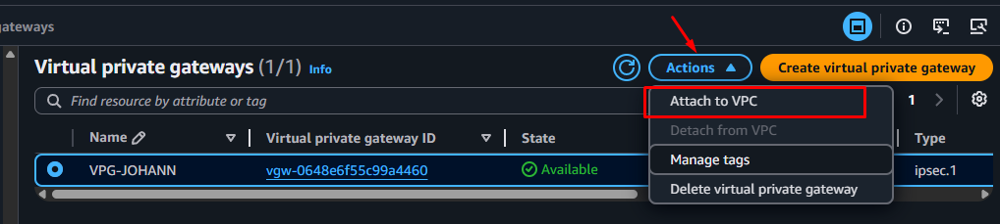
# 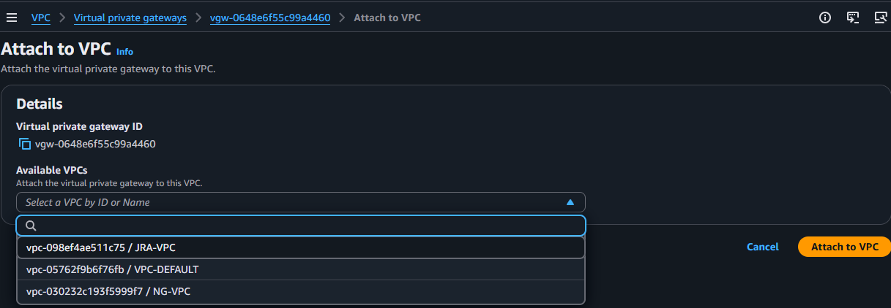

3.	Later, go to “VPC > Site to site VPN connections”, to create the VPN. In this case we’ll use Virtual private gateway, that’s why we’ve created it before, and we will choose the Customer gateway created before. In routing options we’ll use “static”, and the other options we’ll let them by default.

# 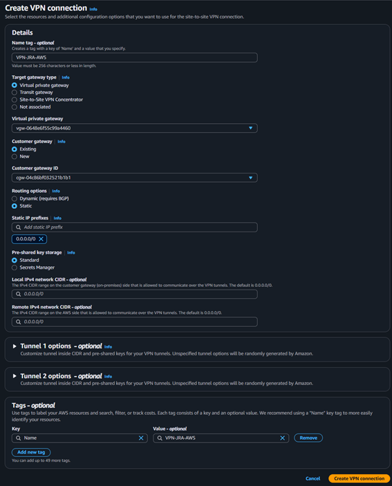

After that, you must download the configuration, depending on your customer gateway:

# 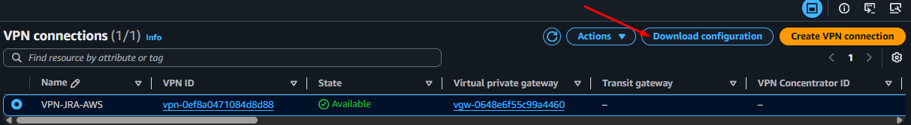
# 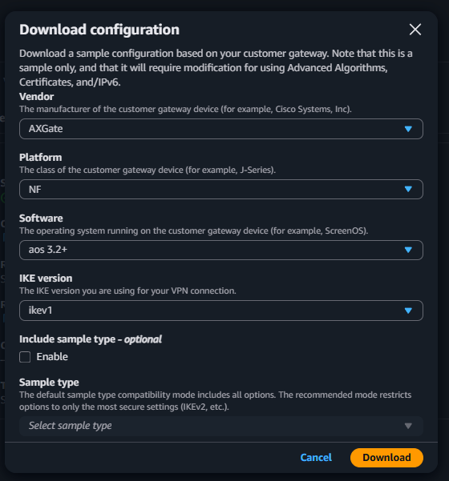

With the downloaded configuration file, you must establish and configure the policies and connection with your on-premise network through your costumer device (router o firewall).

4.	In the Route table of your VPC, you must add a route for your Local CIDR.

# 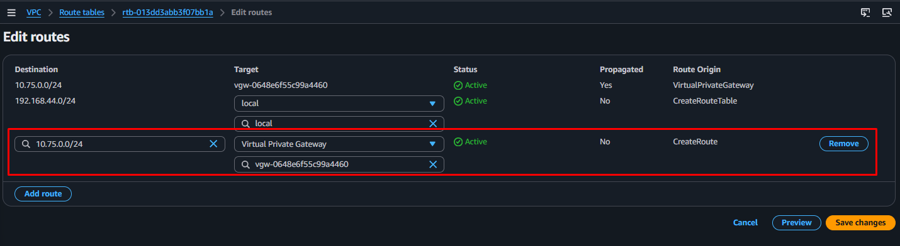

After all of that, you will see the VPN established and UP. By default, AWS creates two tunnels for high availability.

# 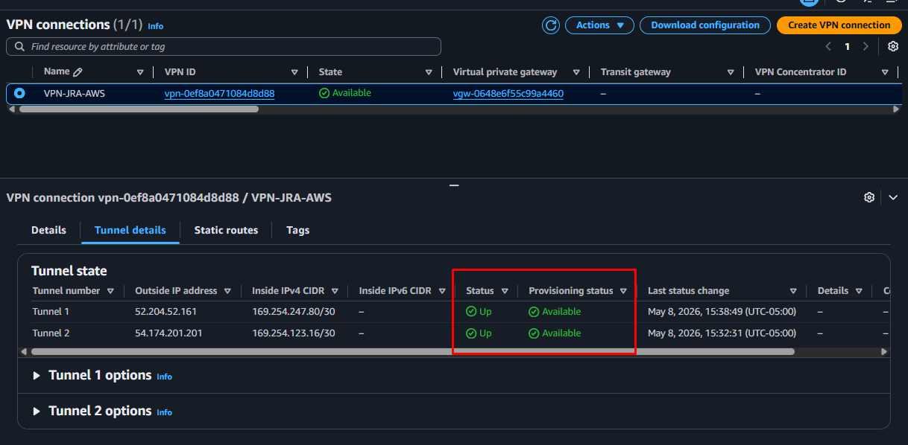
# 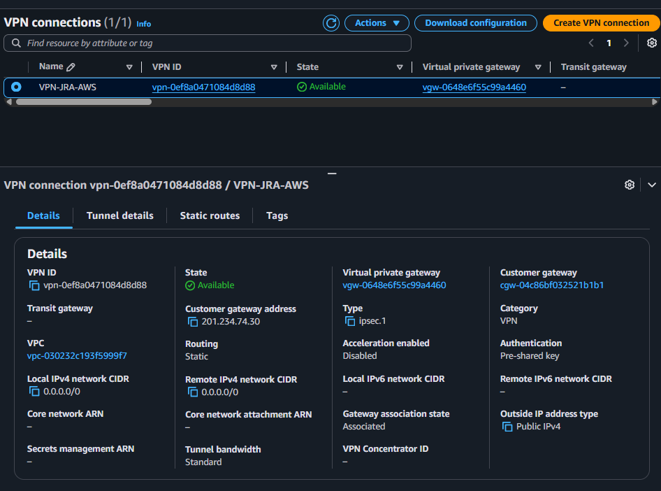

Now, let’s test the connection between my aws VPC and my on-prem network, for that, I run a Test-NetConnection PS command from AWS to On-prem server and Test-NetConnection PS command from On-prem server to AWS server.

# 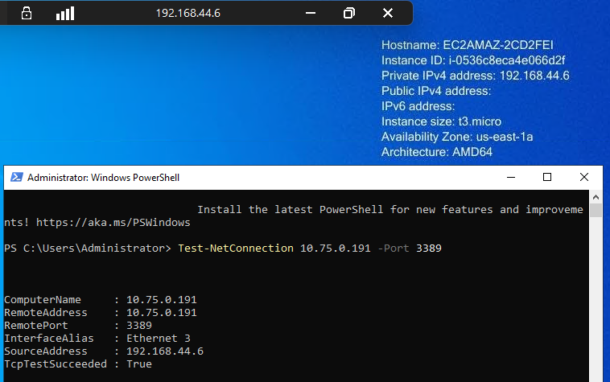
# 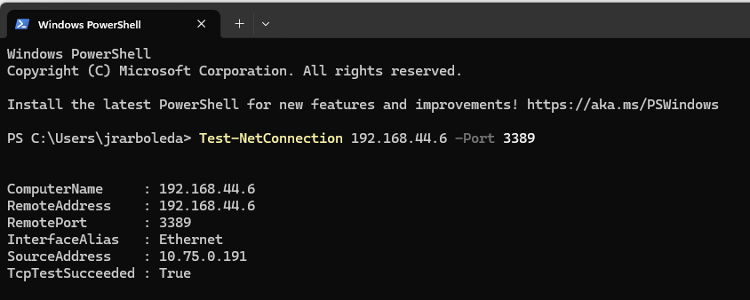

As you can see, the connection was successfully created.

As I said before, by default, AWS creates two tunnels for high availability. I disabled the tunnel one but the connection was never lost.

# 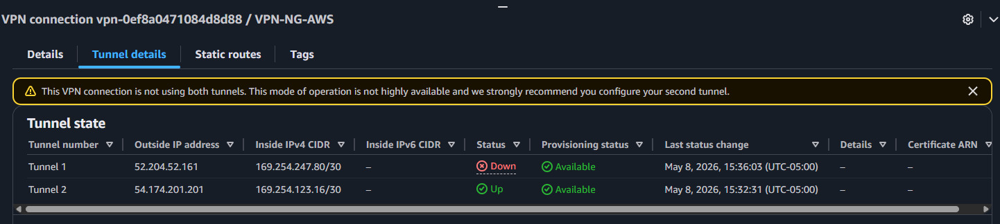

