# HOW TO INSTALL THE CLOUDWATCH AGENT ON AN EC2 LINUX INSTANCE

## Prerequisites:
* The EC2 instance must have a role with the following permissions:

AmazonSSMManagedInstanceCore

CloudWatchAgentAdminPolicy

CloudWatchAgentServerPolicy

CloudWatch is a monitoring and observability service provided by AWS, it collects basic metrics and CloudWatch agent is a small program you install on your server (on-premises or VM) so it can collect more detailed data to AWS CloudWatch, because it can see inside your server’s operating system.

## STEPS:
1.	Assign the role described in the prerequisites:

# 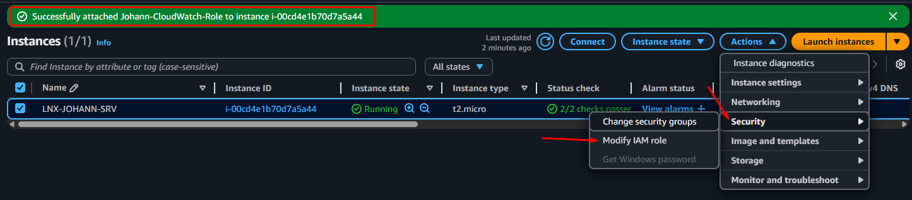

## RECOMMENDATION:
If you attach the role, in the CloudWatch pane, you will see the SSM Agent column as “Inactive”, to solve this, you need to restart your EC2 instance:

Before the reboot

# 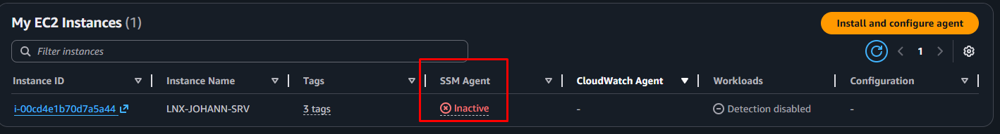

After the reboot
# 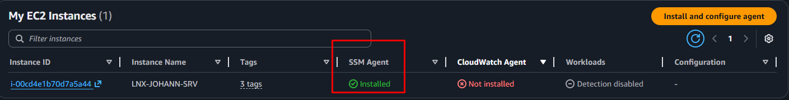

To make an example, let’s install a web server on the EC2 to collect access and errors logs:

# 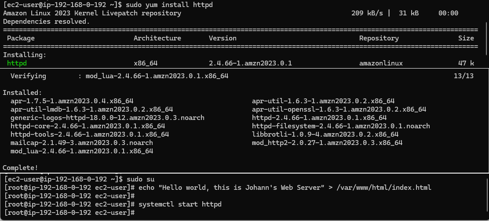
# 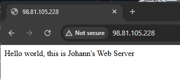

2. To install the CloudWatch Agent, run the following commad:

            sudo yum install amazon-cloudwatch-agent

After that, in the CloudWatch pane, you will see the CloudWatch Agent column as “Installed”. 

3. To configure the agent, run the following commad:

            sudo /opt/aws/amazon-cloudwatch-agent/bin/amazon-cloudwatch-agent-config-wizard

Then, you must enter some of the options provided by the wizard, just adjust them as needed:

# 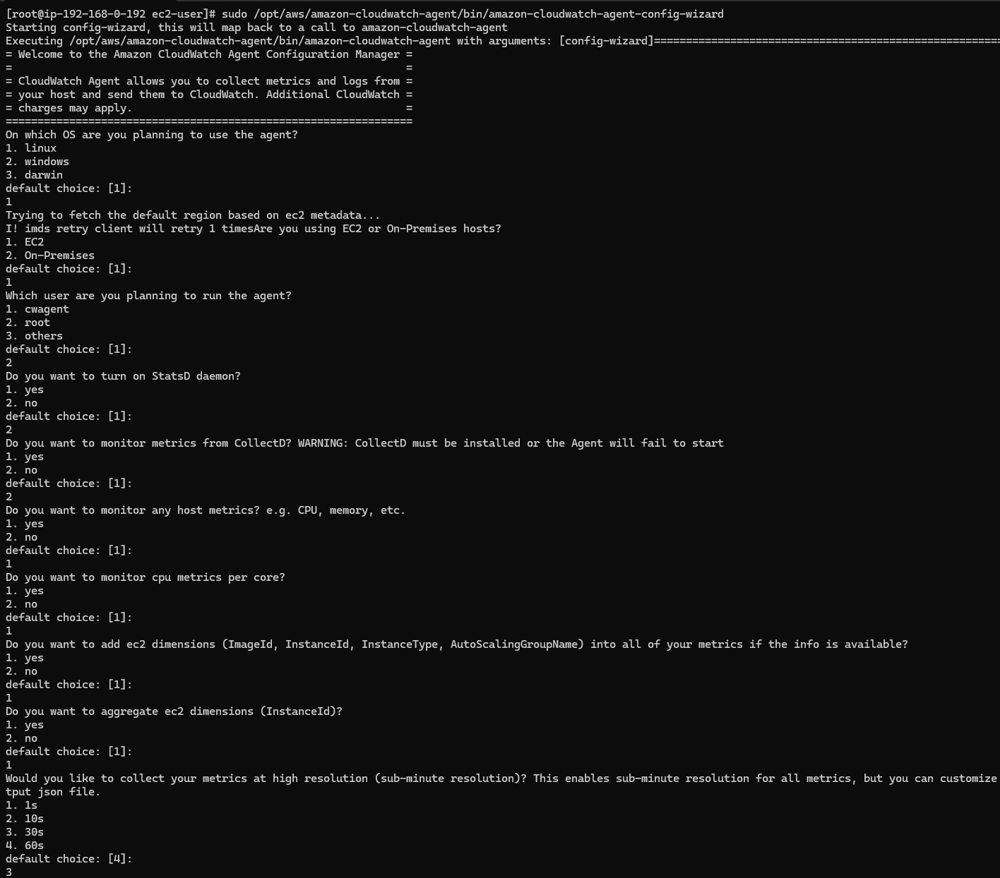
# 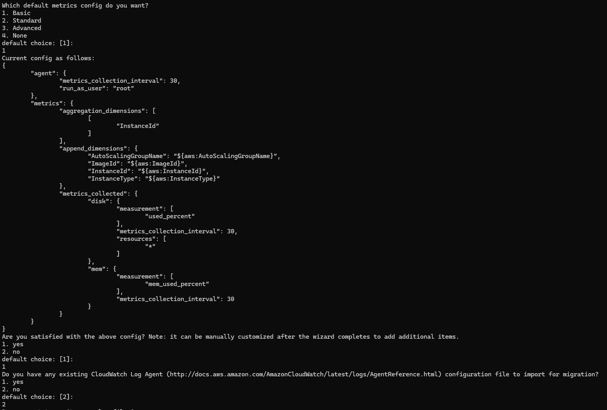
# 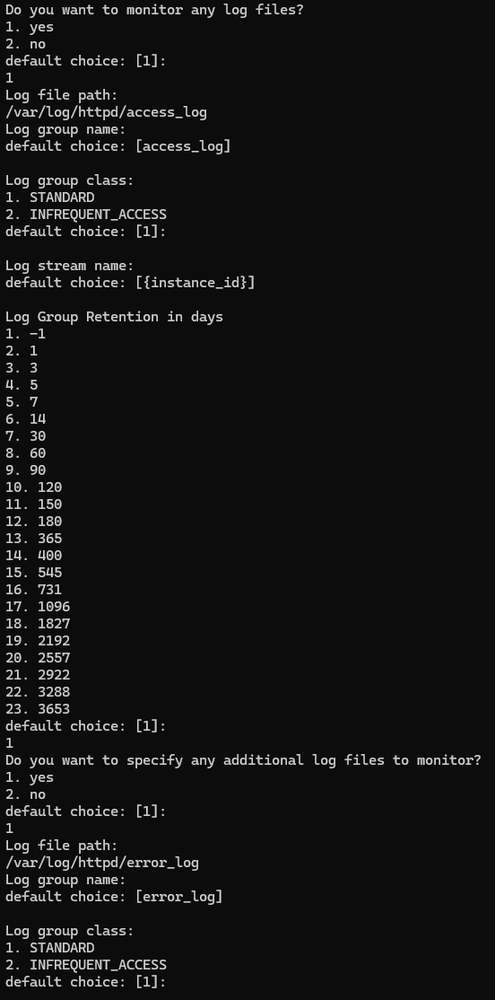
# 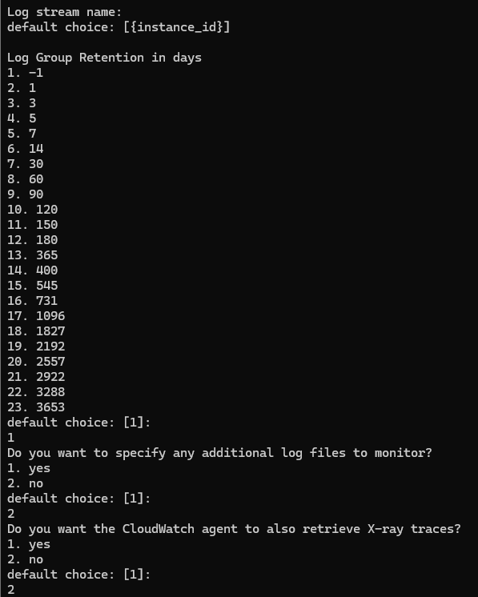
# 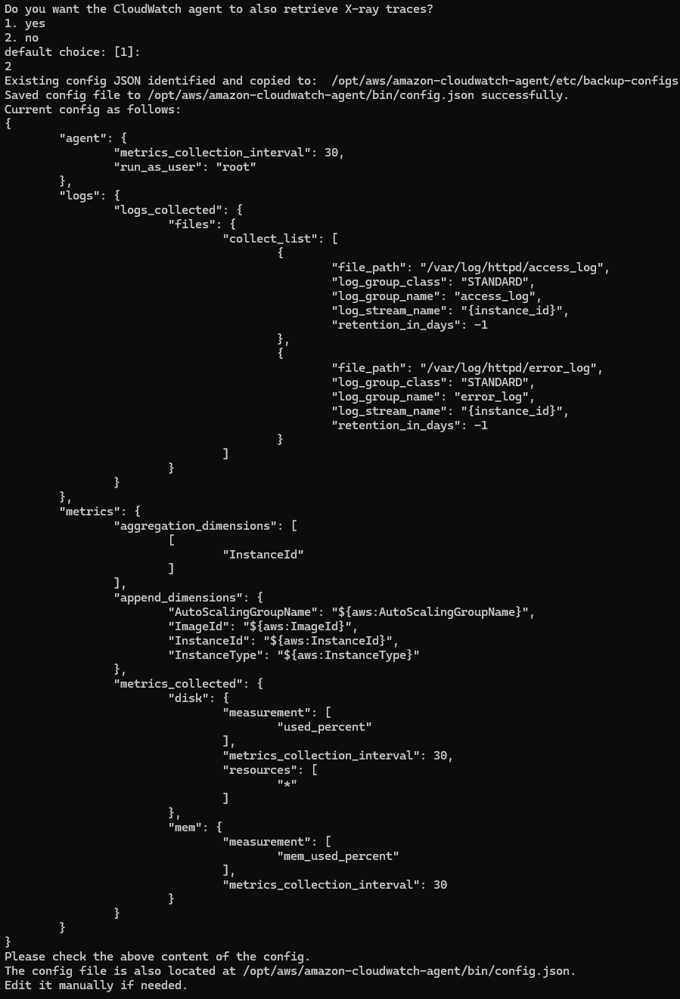

After that, in the CloudWatch pane, you will see the Configuration column as “Configured”. 

# 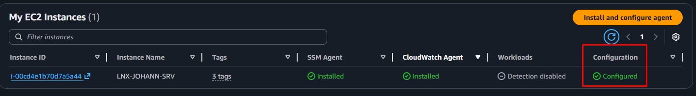

4. Then, execute the following command to get the configuration from AWS System Manager (SSM) and start the agent:

            sudo /opt/aws/amazon-cloudwatch-agent/bin/amazon-cloudwatch-agent-ctl -a fetch-config -m ec2 -c ssm:AmazonCloudWatch-linux -s

or you can use the following command to get the configuration from the local JSON file inside the EC2 instance and start the agent:

            sudo /opt/aws/amazon-cloudwatch-agent/bin/amazon-cloudwatch-agent-ctl -a fetch-config -m ec2 -c file:/opt/aws/amazon-cloudwatch-agent/bin/config.json -s

# 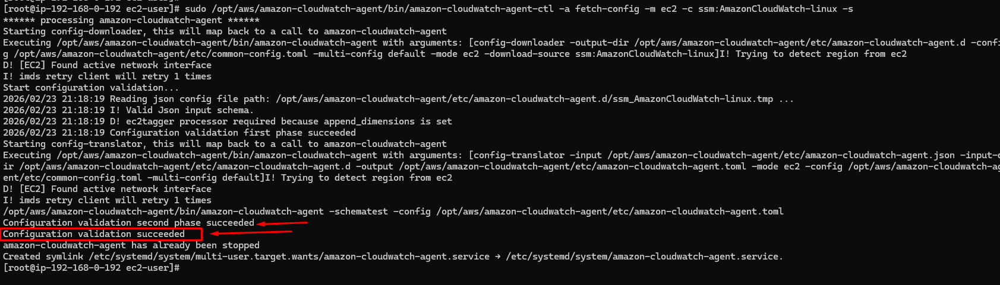

As a result, you can see the logs and metrics in the CloudWatch Logs pane, at the left of the screen:

# 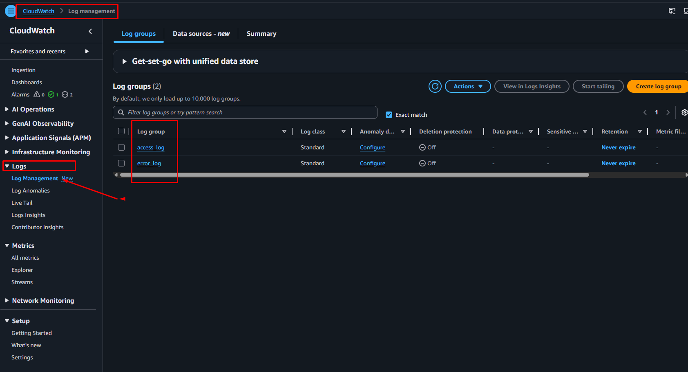

