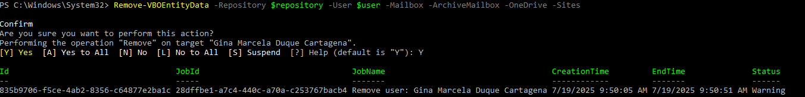

## HOW TO DELETE THE BACKUP OF AN OFFICE 365 ACCOUNT FROM THE VEEAM REPOSITORY

To remove the user's backup, it's recommended to wait until the user's retention policy has expired. However, the following steps allow you to delete the backup before that retention period is reached.

###  STEPS:

1. Open a Powershell window where Veeam For Office 365 is installed (Version 8.1.1.2105 P20250514) and run the following command:

### Get-VBORepository

With the output of this command, you must identify the name of the organization to which the user whose backup you want to delete belongs.

2. After identifying the name of the organization in question, you must store that result in a variable as follows:

### $repository = Get-VBORepository -Name "Net"

3. Then, run the following command, in which you must write the name of the user whose backup you want to delete.

### $user = Get-VBOEntityData -Type User -Repository $repository -Name "Gina Marcela Duque Cartagena"

4. Finally, run the following command to delete the backup (Sites, Archive, Mail, One Drive, and sites related to the user). You must type the letter "Y" to confirm the deletion:

### Remove-VBOEntityData -Repository $repository -User $user -Mailbox -ArchiveMailbox -OneDrive -Sites

After that, you can verify that the backup has been deleted by attenting to recover any file from the user's backup, this should not be possible, as it has been removed. 

Additionally, if email notifications are enabled, you will receive a notification that the backup has been deleted, as follows:

