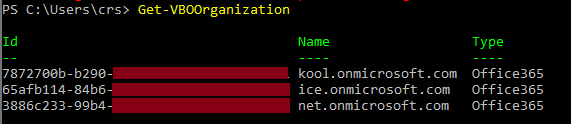
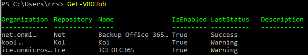
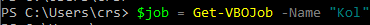

## HOW TO REMOVE A USER FROM THE VEEAM FOR OFFICE 365 BACKUP JOB

Since a user cannot be removed or excluded from de Veeam For OF365 backup job if that user was previously deleted from the OF365 tenant, the following steps must be taken:

### STEPS:

1. Open a Powershell window where the Veeam For Office 365 is installed (in this case (Version 8.1.1.2105 P20250514) and run the following command:

####    Get-VBOOrganization

# 

2. After identyfing the name of the organization in question, that resulte must be  stored in a variable, as follows:

### $org = Get-VBOOrganization -Name "kool.onmicrosoft.com"

# 

3. Then, identify the name of the user you want to delete and store it in a variable:

### $user = Get-VBOOrganizationUser -Organization $org -DisplayName "Mercadeo Kool"

# 

4. Then, call the variable $user

# 

5. Later, run the following command (taking into account whether the user has Mail and/or OneDrive backup)

### $backupItemUser = New-VBOBackupItem -User $user -Mailbox:$True -ArchiveMailbox:$True -OneDrive:$false

# 

6. Since it is necessary to know the job name, the following command can be executed to obtain it:

### Get-VBOJob

# 

7. The job name is stored in other variable:

### $job = Get-VBOJob -Name "Kol"

# 

8. Finally, run the following command:

### Remove-VBOBackupItem -Job $job -BackupItem $backupItemUser

# 

After all of this, the backup job can be executed to verify if the user is still being processed or has been successfully removed.

